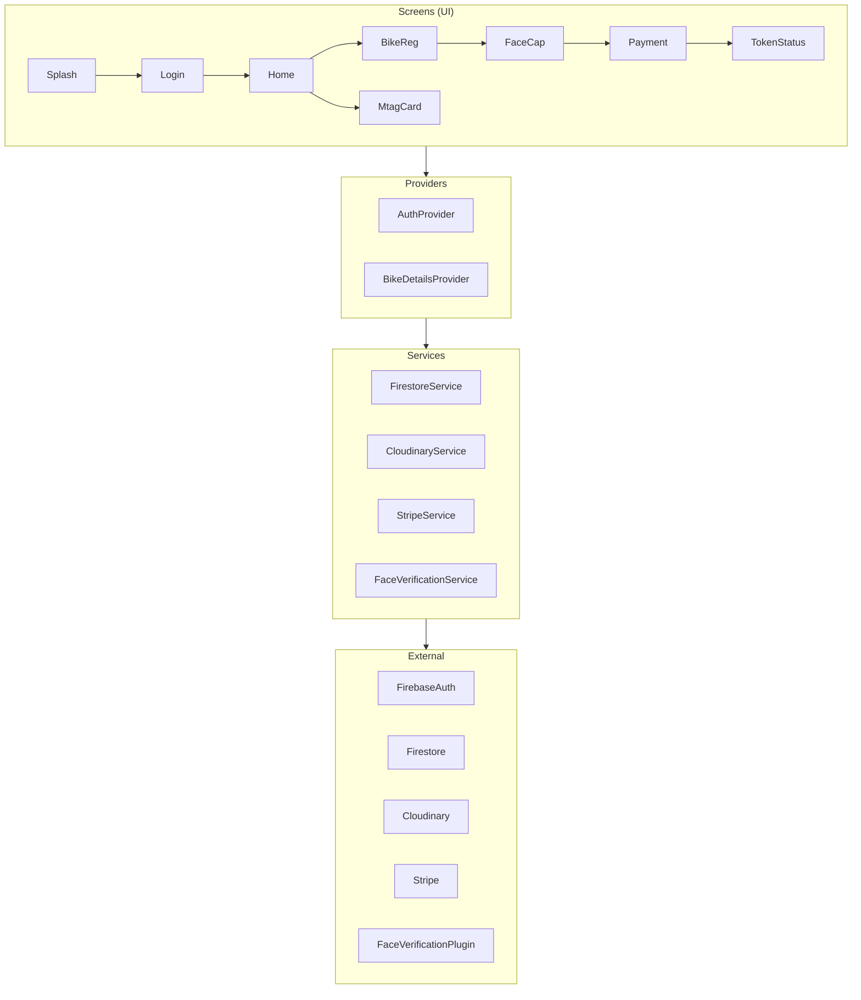
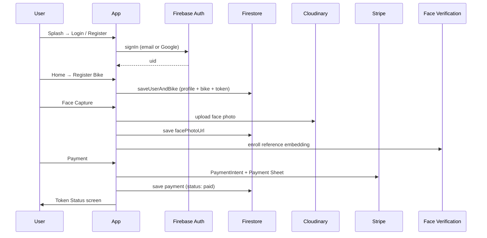
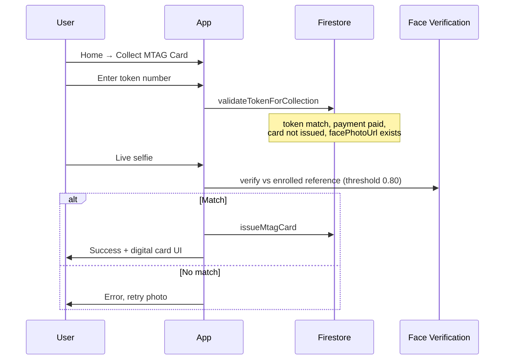

# MTAG Queue Skipper — App Documentation

Flutter mobile app for motorcycle (MTAG) registration, queue token management, online payment, face-based identity verification, and physical MTAG card collection.

---

## Table of contents

1. [Overview](#overview)
2. [Tech stack](#tech-stack)
3. [Project structure](#project-structure)
4. [Architecture](#architecture)
5. [User flows](#user-flows)
6. [Screens & navigation](#screens--navigation)
7. [State management](#state-management)
8. [Data model (Firestore)](#data-model-firestore)
9. [Services](#services)
10. [Face verification](#face-verification)
11. [UI design system](#ui-design-system)
12. [Configuration](#configuration)
13. [Platform notes](#platform-notes)

---

## Overview

**MTAG Queue Skipper** lets a rider:

1. Sign up / log in (email or Google)
2. Register their bike and owner details
3. Capture a reference face photo
4. Pay a registration fee (Stripe test mode)
5. Receive a queue **token** with estimated wait time
6. Later, collect their **MTAG card** at the counter by entering their token and passing a live face match against the stored photo

The app is built for **Pakistan** context (CNIC and mobile number validators).

---

## Tech stack

| Layer | Technology |
|--------|------------|
| Framework | Flutter (Dart SDK ≥ 3.11) |
| State | `provider` (`ChangeNotifier`) |
| Auth | Firebase Auth + Google Sign-In |
| Database | Cloud Firestore |
| Images | Cloudinary (unsigned upload preset) |
| Payments | Stripe Payment Sheet (`flutter_stripe`) |
| Face identity | `face_verification` (on-device FaceNet TFLite embeddings) |
| Camera | `camera` + `permission_handler` |

---

## Project structure

```
lib/
├── main.dart                 # App entry, Firebase/Stripe/face init, routes
├── firebase_options.dart     # Generated Firebase config
├── config/
│   ├── cloudinary_config.dart
│   ├── stripe_config.dart    # Imports local stub or stripe_config.local.dart
│   └── stripe_config_stub.dart
├── constants/
│   ├── app_colors.dart
│   ├── app_fonts.dart
│   └── app_theme.dart
├── models/
│   ├── user.dart
│   └── bike_details.dart
├── providers/
│   ├── auth_provider.dart
│   └── bike_details_provider.dart
├── screens/                  # One file per route/screen
├── services/
│   ├── firestore_service.dart
│   ├── cloudinary_service.dart
│   ├── stripe_service.dart
│   └── face_verification_service.dart
├── utils/
│   ├── token_display.dart
│   └── pakistan_validators.dart
└── widgets/
    ├── mtag_ui.dart          # Shared UI components
    └── google_logo.dart
```

---

## Architecture

High-level layering:



**Patterns used**

- **Provider** for app-wide auth user and bike/token state
- **Service classes** for Firebase, Cloudinary, Stripe, and face checks (no repository layer; services called from screens/providers)
- **Named routes** in `MaterialApp.routes`
- **Route arguments** (`Map`) for passing token metadata through registration → face → payment → token status

---

## User flows

### Flow A — First-time registration (happy path)



### Flow B — Collect MTAG card (counter)



### Flow C — Returning user

- Login → `AuthProvider` loads profile from Firestore
- `BikeDetailsProvider.loadForUser(uid)` restores bike + token from `bikeRegistration`
- Home shows active token strip if `hasToken`
- Status **Card Issued** and estimated time **—** when `mtagCard.issued` is true (see `TokenDisplay`)

---

## Screens & navigation

| Route | Screen | Purpose |
|-------|--------|---------|
| `/` (home) | `SplashScreen` | Brand splash (~5s) → Login |
| `/login` | `LoginScreen` | Email/password + Google |
| `/register` | `RegisterScreen` | Sign up + Google |
| `/home` | `HomeScreen` | Hub: services list, welcome card, token strip |
| `/bike-register` | `BikeRegisterScreen` | Owner + bike form, generates token |
| `/face-capture` | `FaceCaptureScreen` | Camera selfie → Cloudinary + face enroll |
| `/payment` | `PaymentScreen` | Stripe payment for registration fee |
| `/token-status` | `TokenStatusScreen` | Token details, link to collect card |
| `/mtag-card` | `MtagCardIssuanceScreen` | Token verify + face match + issue card |
| `/bike-details` | `BikeDetailsScreen` | Read-only bike & owner info |
| `/profile` | `Profile` | Profile fields + logout |

**Registration pipeline order**

```
bike-register → face-capture → payment → token-status
```

**Route arguments** (passed as `Map` where needed):

- `tokenNumber`, `status`, `estimatedTime`, `generatedAt` — through face capture and payment to token status

---

## State management

### `AuthProvider`

- Wraps **Firebase Auth** and in-memory `User` model
- Methods: `signUpWithEmail`, `signInWithEmail`, `signInWithGoogle`, `logout`
- `loadUserProfileFromFirestore()` merges `name`, `cnic`, `phoneNumber`, `email` from `users/{uid}`
- Listens to `authStateChanges` for session updates

### `BikeDetailsProvider`

- Holds `BikeDetails?`, token fields, `mtagCardIssued`
- `loadForUser(uid)` / `saveForUser` / `saveAllForUser` via `FirestoreService`
- Display helpers: `displayTokenStatus`, `displayEstimatedTime`, `isCardCollected` (uses `TokenDisplay`)
- Token generated locally on bike submit: `TKN-####` (timestamp-based)

---

## Data model (Firestore)

Single collection: **`users`**, document ID = Firebase **`uid`**.

```json
{
  "email": "user@example.com",
  "name": "Full Name",
  "cnic": "3520212345671",
  "phoneNumber": "03001234567",
  "updatedAt": "<server timestamp>",

  "facePhotoUrl": "https://res.cloudinary.com/.../face.jpg",
  "facePhotoCapturedAt": "<timestamp>",

  "bikeRegistration": {
    "bikeDetails": {
      "plateNumber": "",
      "engineNo": "",
      "chasisNumber": "",
      "brand": "",
      "color": "",
      "year": ""
    },
    "tokenNumber": "TKN-1234",
    "tokenStatus": "Pending Verification | Card Issued",
    "tokenEstimatedTime": "15-20 minutes | —",
    "tokenGeneratedAt": "<ISO8601 string>"
  },

  "payment": {
    "status": "paid",
    "amountCents": 0,
    "currency": "pkr",
    "stripePaymentIntentId": "pi_...",
    "paidAt": "<timestamp>"
  },

  "mtagCard": {
    "issued": true,
    "tokenNumber": "TKN-1234",
    "issuedAt": "<timestamp>"
  }
}
```

**Security expectation:** rules should allow each authenticated user to read/write only `users/{theirUid}`.

---

## Services

### `FirestoreService`

| Method | Description |
|--------|-------------|
| `saveUserProfile` | Merge owner profile fields |
| `getUserProfile` | Read profile |
| `saveBikeRegistration` | Merge `bikeRegistration` |
| `saveUserAndBike` | Profile + bike in one write |
| `saveFacePhotoUrl` | Store Cloudinary URL |
| `savePaymentRecord` | Mark payment paid |
| `validateTokenForCollection` | Checks token, payment, not already issued, face photo exists |
| `issueMtagCard` | Sets `mtagCard.issued`, `tokenStatus: Card Issued`, `tokenEstimatedTime: —` |
| `getBikeRegistration` | Load bike + normalizes card-collected state from `mtagCard.issued` |

All writes call `_requireMatchingUid` so the signed-in user can only modify their own document.

### `CloudinaryService`

- Uploads face JPEG to folder `mtag/users/{uid}` with `public_id: face`
- Requires `cloudName` + `uploadPreset` in `cloudinary_config.dart`

### `StripeService`

- Creates PaymentIntent (backend URL in config) and presents **Payment Sheet**
- Used only on mobile (not web)

### `FaceVerificationService`

- Singleton wrapping `face_verification` plugin
- **Registration:** `registerReferenceFace(uid, imagePath)` — stores FaceNet embedding locally (`imageId: registration`)
- **Collection:** `verifyFaces(uid, storedImageUrl, liveImagePath)` — enrolls from cloud only if not already on device; compares live photo with threshold **0.80**
- Plugin bug workaround: delete existing `(uid, registration)` before re-register

---

## Face verification

| Stage | What happens |
|-------|----------------|
| Registration (`face_capture_screen`) | Photo → Cloudinary → Firestore URL → local embedding enrolled |
| Collection (`mtag_card_issuance_screen`) | Token validated → live photo → compare to reference → issue card on match |

**Not supported on web** — camera and TFLite require iOS/Android.

**Important:** Landmark-only comparison was replaced with **FaceNet embeddings**; different people should not pass at 0.80 threshold.

---

## UI design system

Shared widgets in `lib/widgets/mtag_ui.dart`:

| Widget | Use |
|--------|-----|
| `MtagScreen` | Standard scaffold + app bar |
| `MtagPageHeader` | Title + subtitle + optional icon |
| `MtagCard` | White bordered card |
| `MtagHighlightBanner` | Blue (`#EEF3FF`) highlight block |
| `MtagPrimaryButton` / `MtagOutlinedButton` | Black primary actions |
| `MtagGoogleButton` + `GoogleLogo` | Auth Google sign-in |
| `MtagAuthLayout` | Login/register layout |
| `MtagInfoTile` | Label/value rows |

**Visual language (aligned with home screen)**

- Background: `#F5F5F5`
- Primary green gradient: `#01411C` → `#027A2E` (MTAG branding)
- Accent blue highlight: `#EEF3FF`
- Cards: white, 14px radius, light border
- Typography: bold headings (`w800`), muted subtitles (`black54`)
- Casual copy, not corporate

Constants: `app_colors.dart`, `app_theme.dart`, `app_fonts.dart`.

---

## Configuration

| File | Purpose |
|------|---------|
| `lib/config/cloudinary_config.dart` | `cloudName`, `uploadPreset` |
| `lib/config/stripe_config.dart` | Re-exports local or stub Stripe keys |
| `lib/config/stripe_config.local.dart` | **Gitignored** — real test keys (copy from `.example`) |
| `lib/firebase_options.dart` | Firebase project keys (FlutterFire) |
| `android/app/google-services.json` | Android Firebase |
| iOS `Info.plist` | Camera usage, Google URL scheme |

**Google Sign-In (Android):** SHA-1 must be registered in Firebase Console (see `AuthProvider` error message for debug SHA-1).

---

## Platform notes

| Feature | Android / iOS | Web |
|---------|----------------|-----|
| Firebase Auth | ✅ | ✅ |
| Firestore | ✅ | ✅ |
| Google Sign-In | ✅ | Limited |
| Camera / face | ✅ | ❌ |
| Stripe Payment Sheet | ✅ | ❌ |

**Validators** (`pakistan_validators.dart`):

- **CNIC:** 13 digits, first digit 1–7
- **Phone:** `03XXXXXXXXX` (11 digits) or `92XXXXXXXXXX` normalized to local

---

## Dependency summary (`pubspec.yaml`)

```yaml
provider, firebase_core, firebase_auth, cloud_firestore,
google_sign_in, camera, permission_handler, http,
flutter_stripe, face_verification, mask_text_input_formatter
```

---

## Quick reference — file to feature

| Feature | Primary files |
|---------|----------------|
| App bootstrap | `main.dart` |
| Login / Google | `login_screen.dart`, `register_screen.dart`, `auth_provider.dart` |
| Bike registration | `bike_register_screen.dart`, `bike_details_provider.dart` |
| Face photo | `face_capture_screen.dart`, `cloudinary_service.dart`, `face_verification_service.dart` |
| Payment | `payment_screen.dart`, `stripe_service.dart` |
| Token UI | `token_status_screen.dart`, `token_display.dart` |
| Card collection | `mtag_card_issuance_screen.dart`, `firestore_service.dart` |
| Home hub | `home_screen.dart` |

---

*Last updated to reflect the current codebase structure and flows.*
