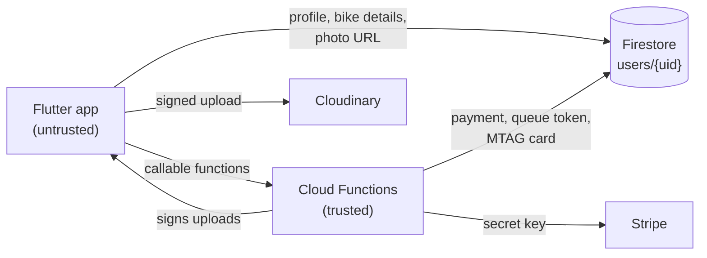

# Security

This document records the security review of MTAG Queue Skipper
(October 2026): what was found, what was fixed, what still needs action, and
the risks that remain. Read it before deploying or publishing the app.

## The core problem

The original app made every important decision on the rider's phone: it
created Stripe payments with the **secret** key, marked itself as paid,
picked its own queue token and issued its own MTAG card. A rider fully
controls the app on their phone, and the Firebase API key in every build is
public by design. So anyone could get a card without paying, without a face
check, and with any token they liked, using nothing more than the Firestore
REST API.

The fix moves those decisions to Cloud Functions (`functions/`) and locks
Firestore so the app can only write the data a rider genuinely owns.



## Findings

| # | Severity | Finding | Status |
|---|----------|---------|--------|
| 1 | Critical | **Stripe secret key shipped in the app.** `StripeService` called the Stripe API with `sk_…` from `stripe_config.local.dart`, which is compiled into every APK/IPA. Anyone holding a build could extract it and control the Stripe account. | Fixed: PaymentIntents are created server-side (`createPaymentIntent`); the key lives in Secret Manager. **Action: roll the key.** |
| 2 | Critical | **Firestore rules let riders write any field of their own document** (`allow read, write: if request.auth.uid == userId`). `payment.status = "paid"`, `mtagCard.issued = true` and any token could be set with one REST call. | Fixed: field-level rules (`firestore.rules`) with 33 emulator tests (`firestore-tests/`). |
| 3 | High | **Payments were never verified.** The app wrote `payment.status = "paid"` itself after the Payment Sheet closed. | Fixed: `confirmPayment` retrieves the PaymentIntent from Stripe and checks owner, status, amount and currency before recording it. |
| 4 | High | **Card issuance was decided by the app**, which wrote `mtagCard.issued` itself. | Fixed: `issueMtagCard` re-checks token ownership, payment, the reference photo and "not issued yet" in a transaction. See remaining risk R1. |
| 5 | High | **Queue tokens were chosen by the app** as `TKN-<time % 10000>`: riders could pick any number, and two riders could easily get the same one. | Fixed: `confirmPayment` assigns sequential tokens from `counters/queueTokens` inside a transaction. |
| 6 | Medium | **Unsigned Cloudinary upload preset in the app.** With the cloud name and preset, anyone could upload arbitrary files to the account under any path. Unsigned uploads also cannot overwrite, so retaking the selfie kept the old photo. | Fixed: uploads are signed by `createFaceUploadSignature` and limited to `mtag/users/{uid}/face`. **Action: delete the unsigned preset.** |
| 7 | Medium | **Release builds were signed with the debug key.** | Fixed: signing from `android/key.properties`. **Action: create an upload keystore before publishing.** |
| 8 | Medium | **Developer diagnostics shown to riders:** the debug signing SHA-1 with Firebase setup steps, "publish security rules" messages and raw plugin errors. The rider's uid was also logged in release builds. | Fixed: `buildAwareMessage` shows hints only in debug builds. |
| 9 | Low | **Selfies (biometric data) were left in the app cache** after every capture and retake. | Fixed: deleted on retake and when the screen closes. |
| 10 | Low | **The reference selfie was uploaded before checking it had exactly one face**, leaving rejected photos stored as the reference. | Fixed: on-device enrolment runs first. |
| 11 | Low | **The `User` model had a `password` field** that `toMap()` would serialise. | Fixed: removed (`UserProfile`). |
| 12 | Low | **A previous rider's registration could survive sign-out** when the profile screen was unmounted mid-logout. | Fixed: the registration is always cleared. |
| 13 | Low | **Build output with absolute local paths was committed** (`.dart_tool/`, `build/`, `*.iml`, `.DS_Store`). | Fixed: untracked and ignored. |

Not a vulnerability: the Firebase `apiKey` values in `firebase_options.dart`,
`google-services.json` and `GoogleService-Info.plist` identify the project
and are meant to be public. Protection comes from the rules and functions
above (and from recommendation R2).

## Required actions before going live

1. **Upgrade the Firebase project to the Blaze plan.** Cloud Functions need it.
2. **Roll the Stripe secret key** (Dashboard → Developers → API keys). The old
   one was inside every build you shared. Store the new one on the server:
   ```bash
   firebase functions:secrets:set STRIPE_SECRET_KEY
   ```
   Then delete the `secretKey` line from your local
   `lib/config/stripe_config.local.dart`; the app no longer uses it.
3. **Configure Cloudinary for signed uploads:**
   ```bash
   firebase functions:secrets:set CLOUDINARY_API_SECRET
   cp functions/.env.example functions/.env.mtag-41516   # then fill in
   ```
   After deploying, **delete the unsigned upload preset** in Cloudinary and
   the now-unused `lib/config/cloudinary_config.local.dart`.
4. **Deploy the backend and rules together:**
   ```bash
   cd functions && npm install && cd ..
   firebase deploy --only functions,firestore:rules
   ```
   The new app needs the functions, and the new rules block the old app's
   writes, so ship the updated app at the same time.
5. **Create an Android upload keystore** and `android/key.properties` (see
   `android/key.properties.example`) before publishing to Play.

## Remaining risks and recommendations

| # | Risk | Recommendation |
|---|------|----------------|
| R1 | **The face match runs on the rider's phone.** The server checks everything else, but a modified app can still claim a match before calling `issueMtagCard`. | Do the match on a staff-operated device at the counter, or server-side (compare the live selfie with the stored photo in a Cloud Function/Cloud Run service). The simplest fallback is a visual check by counter staff. |
| R2 | Any client with the API key can call the backend. | Enable **Firebase App Check** (Play Integrity / App Attest) and set `enforceAppCheck: true` on the callables and on Firestore. |
| R3 | If the app closes between paying and `confirmPayment`, the payment stays unrecorded until the rider taps "Confirm payment". | Add a Stripe webhook (`payment_intent.succeeded`) that records payments server-side as a backstop. |
| R4 | Reference selfies are public Cloudinary URLs; anyone with the URL can view them. | Upload with `type: authenticated` and have a function issue short-lived signed delivery URLs. |
| R5 | Unrestricted Google API keys. | Restrict each key in Google Cloud Console (Android package + SHA-1, iOS bundle ID). |
| R6 | `com.example.*` application/bundle IDs cannot be published. | Choose real IDs before release and re-register the apps in Firebase. |
| R7 | Accounts need no verified e-mail and allow 6-character passwords. | Turn on e-mail verification and a Firebase Auth password policy. |
| R8 | CNICs and face photos are sensitive personal data. | Define a retention period and add account deletion that also removes the Cloudinary image. |
| R9 | A rider who pays twice (two devices at once) is charged twice. | `confirmPayment` logs a warning; refund manually, or automate refunds for duplicate payments. |

## Testing the security boundary

```bash
cd firestore-tests && npm install && npm test   # rules, against the emulator
cd functions && npm install && npm test          # function helpers
flutter test                                     # app controllers and models
```
