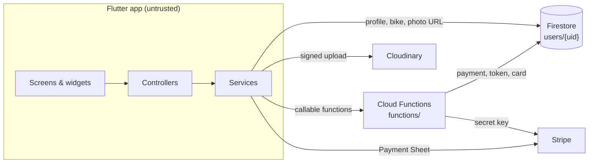
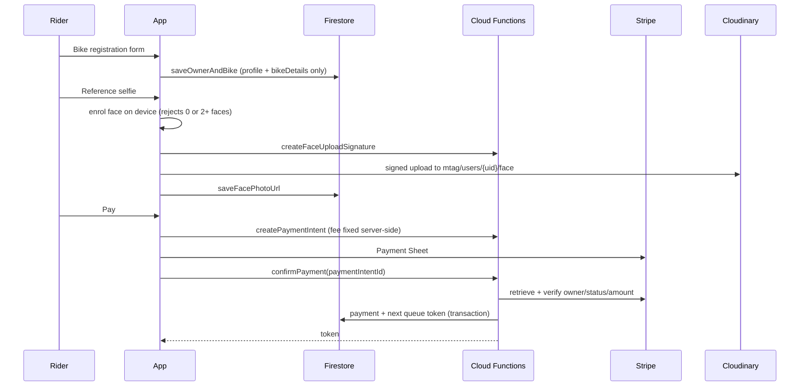

# Architecture

How MTAG Queue Skipper is put together, and the conventions to follow when
you change it. For setup and commands see the [README](../README.md); for the
security model see [SECURITY.md](../SECURITY.md).

## What the app does

A rider registers their motorcycle in Islamabad for an MTAG card without
standing in the queue:

1. Sign up or log in (email/password or Google).
2. Enter owner and bike details.
3. Take a reference selfie.
4. Pay the registration fee (Stripe).
5. Receive a queue token, assigned by the server.
6. At the counter, enter the token and pass a live face check to collect the
   MTAG card.

## The big picture



The app is untrusted: anything that involves money, the queue or issuing a
card is decided by Cloud Functions, and `firestore.rules` only lets the app
write the data a rider owns. See [SECURITY.md](../SECURITY.md).

## Folder map

```
lib/
├── main.dart              Startup: Firebase, Stripe, runApp
├── app/                   MtagApp (providers + MaterialApp) and AppRoutes
├── config/                Build configuration (Stripe publishable key, functions region)
├── core/                  Framework-level code with no feature knowledge
│   ├── errors/            AppException base class, buildAwareMessage
│   ├── state/             SafeChangeNotifier base for screen controllers
│   ├── theme/             AppColors, AppGradients, AppTextStyles
│   └── utils/             Validators (CNIC, phone, e-mail, password)
├── data/
│   ├── models/            Immutable data: UserProfile, BikeDetails, QueueToken, ...
│   └── services/          I/O: Firebase Auth, Firestore, Cloud Functions, Stripe, Cloudinary, face model
├── state/                 App-wide controllers: AuthController, RegistrationController
├── features/              One folder per screen (or flow)
│   └── <feature>/
│       ├── <feature>_screen.dart       Wiring + layout
│       ├── <feature>_controller.dart   State + logic (when the screen has any)
│       └── widgets/                    Widgets used only by this feature
└── shared/
    ├── camera/            Camera controller and views shared by both selfie screens
    └── widgets/           Design-system widgets (MtagScaffold, MtagPrimaryButton, ...)

functions/                 Cloud Functions (TypeScript)
firestore.rules            Who may read/write what in Firestore
firestore-tests/           Rules tests against the Firestore emulator
test/                      Flutter tests, mirroring lib/
```

## Layers and their rules

| Layer | Knows about | Must not |
|-------|-------------|----------|
| **Screen** (`*_screen.dart`) | Its controller, widgets, `AppRoutes` | Call services, contain business rules |
| **Widgets** (`widgets/`, `shared/widgets/`) | Data passed in through the constructor | Read providers deep in the tree unless they are a step of a flow |
| **Controller** (`*_controller.dart`, `lib/state/`) | Services, models, other controllers | Import Material widgets or use `BuildContext` |
| **Service** (`lib/data/services/`) | One external system each | Hold UI state or know about screens |
| **Model** (`lib/data/models/`) | Plain Dart | Depend on Flutter widgets or Firebase |

In short: **views render state and forward taps, controllers decide,
services talk to the outside world, models carry data.**

### Anatomy of a screen

Every screen with logic follows the same three-part shape. Payment, for
example:

```dart
// payment_screen.dart: creates the controller, no logic of its own.
class PaymentScreen extends StatelessWidget {
  @override
  Widget build(BuildContext context) {
    return ChangeNotifierProvider(
      create: (context) => PaymentController(
        auth: context.read(),
        registration: context.read(),
      ),
      child: const _PaymentView(),
    );
  }
}

// The view reads state and maps outcomes to navigation/snackbars.
class _PaymentView extends StatelessWidget {
  Future<void> _pay(BuildContext context) async {
    final navigator = Navigator.of(context);
    final outcome = await context.read<PaymentController>().pay();
    if (outcome == PaymentOutcome.paid) {
      unawaited(navigator.pushReplacementNamed(AppRoutes.tokenStatus));
    }
  }

  @override
  Widget build(BuildContext context) {
    final controller = context.watch<PaymentController>();
    // ... layout using controller.isPaying, controller.error ...
  }
}

// payment_controller.dart: the logic, testable without Flutter widgets.
class PaymentController extends SafeChangeNotifier {
  Future<PaymentOutcome> pay() async { /* backend + Stripe */ }
}
```

Conventions that go with it:

- Screen controllers extend `SafeChangeNotifier`, so notifying after the
  screen closed is harmless.
- Controllers receive services through optional constructor parameters
  (`BackendService? backend`) that default to the real implementation.
  Tests pass fakes.
- Actions return a result the view can act on (`PaymentOutcome`,
  `Future<String?>` error message, `bool`), and any persistent error is
  exposed as `controller.error`.
- Text field controllers and form keys are UI state and stay in the view's
  `State`; the controller receives plain values (e.g.
  `BikeRegistrationInput`).
- Screens without logic (Home, Token Status, Bike Details, Profile) have no
  controller; they read the app-wide controllers directly.
- Keep `main()` to what the first screen needs. Heavy resources load on
  first use: the 94 MB FaceNet model is loaded by
  `FaceVerificationService.ensureInitialized()`, and the selfie controllers
  call `warmUp()` as their camera opens so it is ready by the time the
  rider has taken the photo.

### App-wide state

Provided once in `MtagApp`:

- **`AuthController`**: who is signed in (`UserProfile`), sign-in, sign-up
  and sign-out, profile refresh. Wraps `AuthService`.
- **`RegistrationController`**: the rider's `RegistrationRecord` (bike,
  queue token, card issued). Loaded after sign-in (`AuthFormController`,
  `SplashController`) and cleared on sign-out (`ProfileScreen`).

## Flows

### Registration and payment



If the connection drops after Stripe accepted the payment, the button turns
into **Confirm payment** and only `confirmPayment` is retried, so the rider is
never charged twice.

### Card collection

```mermaid
sequenceDiagram
    participant R as Rider
    participant App
    participant FS as Firestore
    participant CF as Cloud Functions

    R->>App: Enter token
    App->>FS: validateTokenForCollection (fast pre-check)
    R->>App: Live selfie
    App->>App: match against reference (threshold 0.80)
    App->>CF: issueMtagCard(token)
    CF->>FS: re-check token, payment, photo, not issued; issue card
    App->>R: Digital MTAG card
```

The face match runs on the device; see SECURITY.md (R1) for the plan to move
it.

## Firestore data model

One document per rider: `users/{uid}`.

| Field | Written by | Notes |
|-------|-----------|-------|
| `email`, `name`, `cnic`, `phoneNumber` | App | Validated by the rules |
| `bikeRegistration.bikeDetails` | App | `plateNumber`, `engineNo`, `chasisNumber` (legacy spelling), `brand`, `color`, `year` |
| `facePhotoUrl`, `facePhotoCapturedAt` | App | Must be the rider's own Cloudinary upload |
| `bikeRegistration.tokenNumber`, `tokenStatus`, `tokenEstimatedTime`, `tokenGeneratedAt` | Functions | Assigned by `confirmPayment` |
| `payment` | Functions | Recorded by `confirmPayment` after verifying with Stripe |
| `mtagCard` | Functions | Set by `issueMtagCard` |
| `updatedAt` | Both | Server timestamp |

`counters/queueTokens` holds the last token number and is server-only.

## Routing

All routes are constants in `lib/app/app_routes.dart`
(`Navigator.pushNamed(context, AppRoutes.payment)`). Screens get their data
from the controllers, not from route arguments.

## Design system

- Colours, gradients and text styles: `lib/core/theme/`. Do not hard-code
  hex values in widgets.
- Shared widgets: import `lib/shared/widgets/mtag_widgets.dart` for
  `MtagScaffold`, `MtagPageHeader`, `MtagSectionCard`, `MtagInfoTile`,
  `MtagHighlightBanner`, `MtagPrimaryButton`/`MtagOutlinedButton`,
  `MtagEmptyState`, `InlineErrorText` and `mtagInputDecoration`.
- Visual language: grey `#F5F5F5` background, MTAG green gradient
  (`#01411C` → `#027A2E`), white cards with a light border, bold headings.

## Testing

| Suite | Location | Command |
|-------|----------|---------|
| Models, validators, controllers, screens | `test/` | `flutter test` |
| Cloud Functions helpers | `functions/src/*.test.ts` | `cd functions && npm test` |
| Firestore rules | `firestore-tests/` | `cd firestore-tests && npm test` |

Controller tests use the in-memory fakes in `test/helpers/fakes.dart`; no
Firebase project or device is needed.

## Adding a screen

1. Create `lib/features/<name>/` with `<name>_screen.dart`, plus
   `<name>_controller.dart` if the screen does more than display state.
2. Put widgets used only by this screen in `lib/features/<name>/widgets/`;
   reuse `shared/widgets` first.
3. Add a route constant and table entry in `lib/app/app_routes.dart`.
4. Talk to the outside world only through a service in `lib/data/services/`.
   Anything involving money or trust goes through a Cloud Function, plus a
   rule in `firestore.rules`.
5. Add tests under `test/features/<name>/` and run `flutter analyze`.
